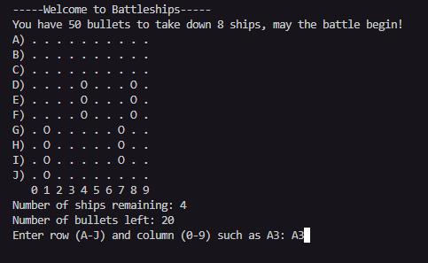

battleships game

 ## Contents

* [User Experience (UX)](#User-Experience-(UX))
    * [Initial Discussion](#Initial-Discussion)
    * [Client Goals](#Client-Goals)

* [Design](#Design)

  * [Wireframes](#Wireframes)
  * [Features](#Features)
  * [Accessibility](#Accessibility)
  * [Technologies Used](#Technologies-Used)
  * [Languages Used](#Languages-Used)
  * [Frameworks, Libraries & Programs Used](#Frameworks,-Libraries-&-Programs-Used)

* [Deployment & Local Development](#Deployment-&-Local-Development)
  * [Deployment](#Deployment)
  * [Local Development](#Local-Development)
    * [How to Fork](#How-to-Fork)
    * [How to Clone](#How-to-Clone)

* [Testing](#Testing)
    
* [Credits](#Credits)
  * [Code Used](#Code-Used)
  * [Content](#Content)
  * [Media](#Media)
  * [Acknowledgments](#Acknowledgments)
  
  ## User Experience (UX)

### Initial discussion
In project 3 I programmed a game called "Battleship".
The game is a simple  Battleship game. But this time it's a little different The player has a certain amount of bullets To take down the computerships That are randomly placed By the computer.

User stories
#### Client goals

The user should be able to play the game without any knowledge of the game

#### First-time visitor goals
I want to find out how the game works
I want to win against the computer
---

Design
The game was programmed in Python to use the terminal. Since the game is text-based, it has no real design

Features
Game Start, Player has a certain amount of bullets to Tack down the enemy ships. A small instruction of what to do is shown.

After The computer Places all there ships, there is a description of the game. The game starts automatically.

At first, the player has to choose a column A-3

If the player hits a computer ship, it will be pointed out with a hit message.

If the player misses a computer ship it shows the miss message.

If the player wins the game, the game shows the "You win" message as shown in the image below:

If the player loses the game, the game shows the "You loose" message:

After win, loss , the game ends.

---
