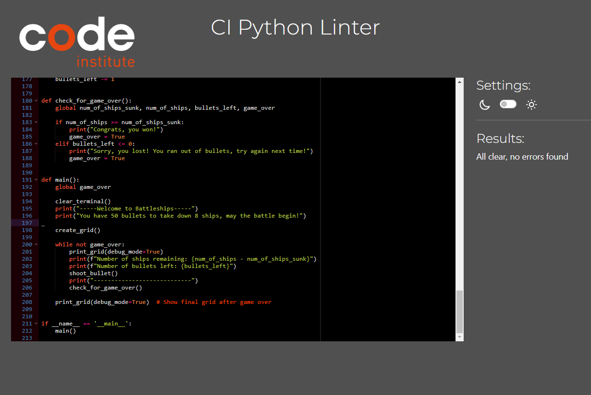

 ## Portfolio Project 3 Python. A simple battleships game

## Contents

* [AUTOMATED TESTING](#automated-testing)
    * [CI Python Linter](#CI-Python-Linter)
    * [Grammarly](#Grammarly)
    

* [MANUAL TESTING](#manual-testing)
    * [Full Testing](#full-testing)
    * [User Stories](#user-stories)
    * [Browser Testing](#browser-testing)

* [BUGS](#bugs)
    * [Known Bugs](#known-bugs)
    * [Solved Bugs](#solved-bugs)

---

### CI Python Linter

### Grammarly

[Grammarly](https://www.grammarly.com/grammar-check) was used to prevent spelling mistakes

---

## MANUAL TESTING

Here's a detailed testing sheet for the solved bugs based on the issues i encountered in my Battleship game code, along with their resolutions. 

### Bug Testing Sheet

| Bug No | Bug Issue                                                              | How Resolved                                                                                                                 | Status/Post-resolution notes                                                                                                        |
|--------|------------------------------------------------------------------------|-----------------------------------------------------------------------------------------------------------------------------|-------------------------------------------------------------------------------------------------------------------------------------|
| 1      | Computer ships placed on already occupied fields                      | Implemented a check in the `validate_grid_and_place_ship` function to ensure that computer ships are not placed on already occupied fields.                             | Confirmed that ships are no longer placed on occupied cells; all tests related to this functionality passed.                       |
| 2      | Incorrect selection of ship coordinates by the player                  | Added input validation in the `accept_valid_bullet_placement` function to ensure that the player cannot select coordinates that had already been guessed.             | Validated through multiple inputs; players cannot select previously shot locations successfully.                                  |
| 3      | Incorrect hit-and-miss validation                                      | Updated the hit-and-miss tracking in `shoot_bullet` and ensured `X` or `#` is displayed correctly upon hits or misses, preventing repeated guesses. | Hit and miss messages are accurately reflecting the player's shot; no incorrect messages appear.                                     |
| 4      | If space is entered, the game is aborted                              | Applied the `strip()` method to remove spaces and trailing whitespaces in user input when reading guesses.                                              | Spaces do not cause the game to abort; inputs with only spaces prompt for correction.                                               |
| 5      | If only Enter was pressed, the game is aborted                        | Added handling in `accept_valid_bullet_placement` to manage empty input gracefully, ensuring that it prompts the user for input again instead of aborting.          | Testing showed that pressing only Enter correctly prompts the user to re-enter their guess, maintaining game flow.                  |
| 6      | Issues with the `msvcrt` module on Heroku                             | Replaced the `msvcrt` module with standard input handling using `sys` and modified game exit to allow quitting with "exit" command or by pressing Enter.           | Successfully migrated input handling without crashes; exit mechanism works in both local and deployment (Heroku) environments.       |

### Testing Strategy
1. **Manual Testing**: Each bug was initially identified through gameplay and tested by simulating various scenarios.
2. **Input Validation**: Particular attention was given to validate user input for edge cases (like repetitive inputs, incorrect formats).
3. **Gameplay Sessions**: Extensive game sessions were conducted to ensure that all components (shots, ship placements, game-over conditions) interacted cohesively.
4. **Automated Scripts**: If possible, consider writing unit tests for critical functions such as `accept_valid_bullet_placement`, `validate_grid_and_place_ship` to automate regression testing in the future.

### Conclusion
This testing sheet outlines each bug, the resolution made, and its status, ensuring transparency in the debugging process.

- - -

### Full Testing
# Full Testing Documentation

Full testing was performed on the game in the Visual Studio Code Terminal.

| Feature                  | Expected Outcome                            | Testing Performed                                   | Result                         | Pass/Fail |
| ------------------------ | ------------------------------------------ | ---------------------------------------------------    | -------------------------    | --------- |
| Initial Ship Placement   | Computer's ships placed correctly          | Verified placement of computer ships on the game board | Ships placed correctly       | Pass      |
| Invalid Guess            | Player cannot guess the same spot twice    | Attempted to guess the same location consecutively     | Repeated guess rejected      | Pass      |
| Player Turn - Hit        | Player hits a computer ship                | Guessed a location that contains a computer ship       | Hit confirmed                | Pass      |
| Player Turn - Miss       | Player misses a computer ship              | Guessed a location without a computer ship             | Miss confirmed               | Pass      |
| Player Turn - Bullets    | Player runs out of bullets                 | Depleted bullet count by guessing without hits         | No guesses allowed           | Pass      |
| Player Wins              | Player sinks all computer ships            | Player hits all computer ship locations                | Player wins                  | Pass      |
| Ran out of bullets       | player hasn't won within turns limit       | Reached maximum turns without a decisive outcome       | Player loses                 | Pass      |

## Summary
All features tested have passed successfully, demonstrating that the game operates as intended. The mechanics of guessing ship locations, tracking hits and misses, and managing bullet counts function correctly, with accurate win conditions in place.
---

Back to [README.md](README.md)